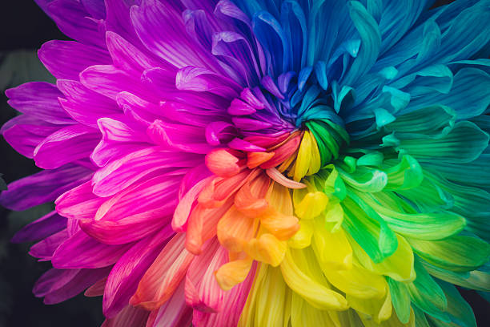

# Image Color Classifier - Theory

## How It Works: Technical Explanation

### 1. Color Space Conversion
- Input images are converted from BGR (OpenCV default) to RGB color space
- RGB represents colors as combinations of Red, Green, and Blue channels (0-255 each)

### 2. Image Preprocessing
- Automatic resizing while maintaining aspect ratio (max dimension = 500px)
- Preserves color information while improving processing speed
- Handles various formats: JPEG, PNG, WEBP through OpenCV's adaptive decoding

### 3. K-means Clustering
- **Pixel Vectorization**: Image is flattened into a list of 3D vectors (R,G,B values)
- **Cluster Initialization**: Randomly selects k initial color centers (k=3 by default)
- **Distance Calculation**: Uses Euclidean distance between pixels and centers
- **Iterative Optimization**:
  1. Assigns each pixel to nearest color center
  2. Recalculates centers as mean of assigned pixels
  3. Repeats until convergence (max iterations or stable centers)

### 4. Dominant Color Extraction
- Sorts final clusters by pixel count (most to least dominant)
- Extracts cluster centers as RGB values
- Calculates percentage dominance for each color

### 5. Color Naming
- Uses a 25-color reference database (red, blue, etc.)
- Computes minimum Euclidean distance to reference colors
- Returns the closest named color match

### 6. Visualization
- Matplotlib generates side-by-side plots:
  - Left: Original image (resized for display)
  - Right: Color swatches with names and RGB values

# Image Color Classifier

## Sample Results

### Test Image 1

### Test Image 2

